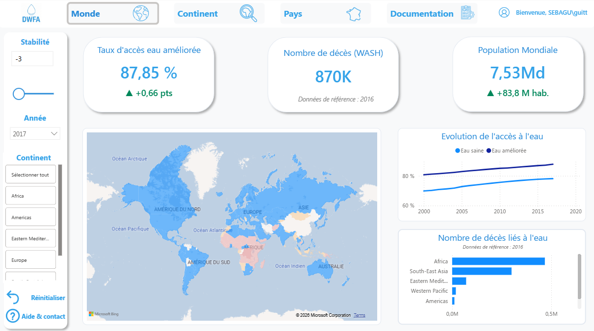
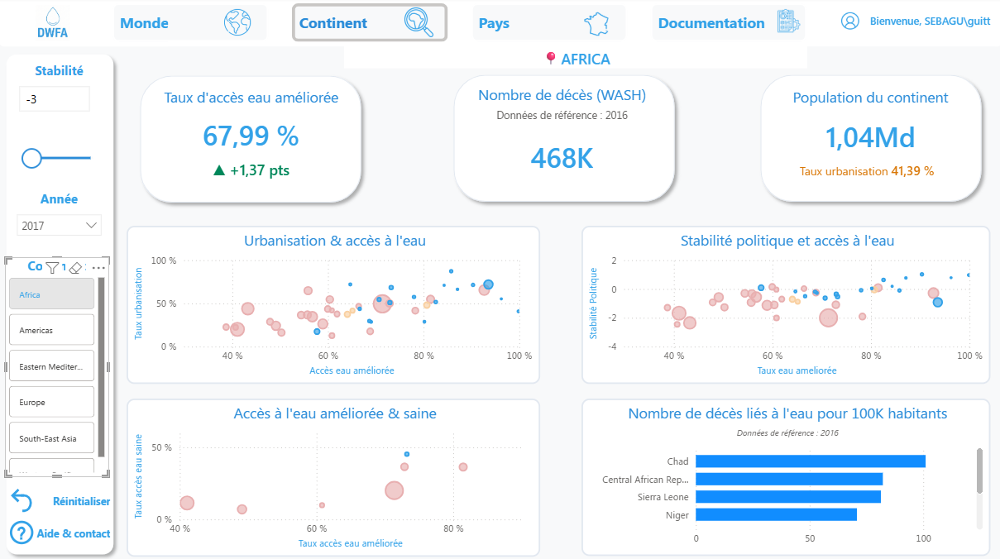
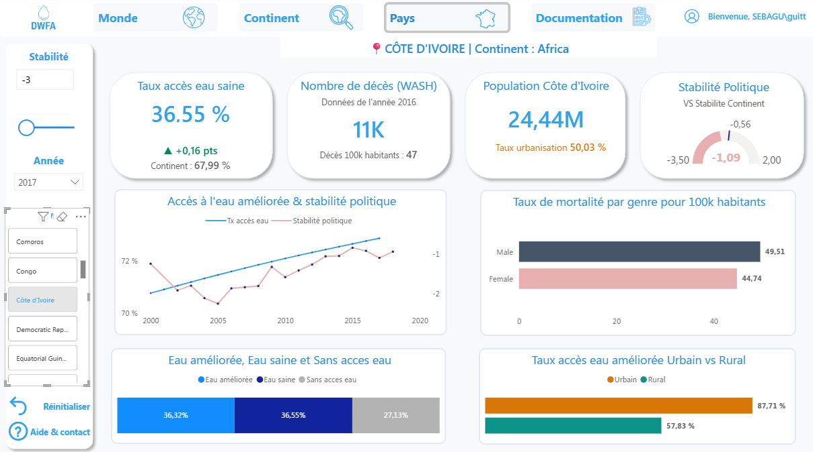

# Dashboard ONG (DWFA) - Pilotage de l'accès à l'eau potable mondiale 

Ce projet est un outil de pilotage d'aide à la décision développée pour une ONG internationale (DWFA). Son objectif est de transformer des données mondiales hétérogènes en une stratégie d'intervention actionnable sur le terrain.

**Stack Technique** : `Power BI` | `Power Query (M)` | `DAX` | `UX/UI Design`


## Vue d'ensemble & contexte métier

Face à l'urgence sanitaire liée au manque d'hygiène et d'infrastructures (WASH), l'ONG DWFA doit optimiser l'allocation de ses ressources matérielles et humaines. La question n'est plus *comment* agir, mais *où* agir en priorité, tout en garantissant la sécurité des équipes.

**Résultats et livrables :**
- Couverture analytique mondiale intégrant les données de l'OMS et de la FAO (historique 2000-2017).
- Qualification des pays selon les 3 domaines d'intervention de l'ONG : Création d'infrastructures, Ingénierie de Modernisation, et Consulting Gouvernemental.
- Intégration d'un indice de "Stabilité Politique" pour l'évaluation des risques opérationnels.
- Conformité de l'interface aux normes d'accessibilité (contraste, colorimétrie inclusive).

<p align="center">
  
</p>

## Architecture et Modèle de Données

Le projet repose sur une consolidation de données multisources. 

- **ETL (Power Query) :** Nettoyage des anomalies de typage (séparateurs décimaux OMS), harmonisation des échelles (multiplication des populations FAO pour alignement de la granularité), et dépivotage.
- **Modélisation :** Schéma relationnel basé sur un filtrage unidirectionnel des dimensions vers les faits.

```text
[Dimensions]                     [Faits]
Dim_Country ─────────(1:N)──────▶ Fact_Water_Access
Dim_Year    ─────────(1:N)──────▶ Fact_Mortality_WASH
                             ───▶ Fact_Population
                             ───▶ Fact_Political_Stability
```

## Métriques clés (DAX)
Privilégiant les mesures dynamiques aux colonnes calculées, le projet exploite la modification de contextes (`CALCULATE`, `REMOVEFILTERS`) pour générer des benchmarks à la volée.

Extrait de code
```
-- Exemple : Calcul de la moyenne continentale de référence (Indépendant du pays survolé)
Moyenne_Morts_Continent = 
VAR ContinentActuel = SELECTEDVALUE('Dim_Country'[Continent])
RETURN
CALCULATE(
    [Tx_mortalite_genre_100k],
    ALL('Dim_Country'[Country]),
    'Dim_Country'[Continent] = ContinentActuel
)
```

## Approche UX & Accessibilité
L'interface a été conçue via un Blueprint en amont pour minimiser la charge cognitive des décideurs :

- Architecture en entonnoir : Parcours strictement guidé : Monde (Macro) → Continent (Ciblage) → Pays (Audit opérationnel).

- Accessibilité inclusive : Les indicateurs critiques (vert/rouge) sont systématiquement doublés par des marqueurs structurels (jauges, libellés "N/A") pour pallier le daltonisme.

- Résilience de la navigation : Utilisation de signets (Bookmarks) verrouillés sur la couche "Données" pour offrir des boutons de réinitialisation des filtres étanches sur chaque page.


## Pages du Dashboard
- Vue Mondiale : État des lieux macro, tendances historiques et filtrage du bruit par niveau de sécurité géopolitique.

- Vue Continentale : Alignement des pays sur les 3 domaines d'intervention (Scatter plots et bar charts de comparaison).

- Fiche Pays (Audit) : Fracture territoriale (Urbain vs Rural) et identification des vulnérabilités de genre pour les campagnes de prévention.

- Documentation : Modèle de données, dictionnaire de données et règles de gouvernance directement intégrés dans l'outil.

<table>
  <tr>
    <td align="center"><br><b>Vue Monde</b></td>
    <td align="center"><br><b>Vue Continent</b></td>
    <td align="center"><br><b>Vue Pays</b></td>
  </tr>
</table>


## Contenu du dépôt
- 01_dashboard_pilotage_dwfa.pbix : Le fichier source Power BI.
- 02_presentation_recommandation_dwfa.pdf : La présentation des recommandations pour la DWFA
- /data : Datasets sources (CSV) et dictionnaire de données.
- /docs : Présentation PDF du Blueprint et Mockups et visuel du modèle de données en constellation.
- /img : Captures d'écran du tableau de bord.


## Démarrage Rapide 
- Clonez ce dépôt sur votre machine locale.

- Ouvrez le fichier 01_dashboard_pilotage_dwfa.pbix avec Power BI Desktop.
*Note : Les données étant importées, le modèle est consultable immédiatement. 
Pour rafraîchir les données, modifiez le chemin source dans les paramètres de la source de données Power Query pour pointer vers votre dossier /data local.*


## Axes d'amélioration
Dans une démarche d'amélioration continue, voici les évolutions de ce produit qui peuvent être réalisées  :

- Optimisation du Modèle : Le modèle actuel s'apparente à une "constellation" (plusieurs tables de faits partageant les mêmes dimensions). L'objectif technique est de consolider ces faits en une table unique via Power Query (Unpivot/Append) pour un schéma en Étoile pur, maximisant la compression du moteur VertiPaq.

- Inclusivité et neurodiversité (TDAH/TSA) : Poursuivre le travail d'accessibilité en réduisant le "bruit visuel" via l'implémentation massive d'info-bulles de pages (Tooltips pages), permettant de masquer la complexité granulaire au premier niveau de lecture.

- Automatisation MLOps : Remplacer le dépôt manuel de fichiers plats par une connexion directe (API ou flux SQL Server) pour un rafraîchissement programmé sur le service Power BI.
